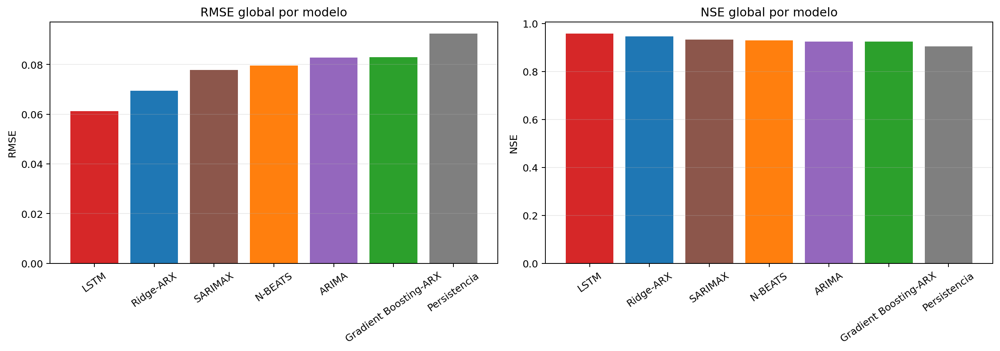
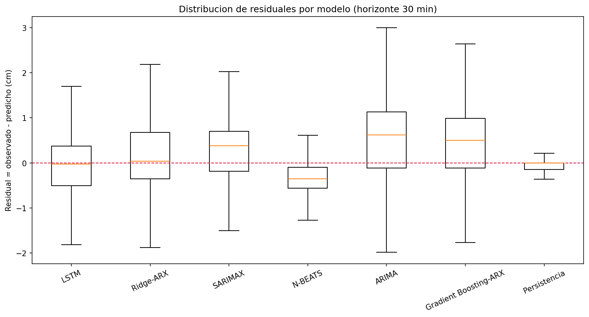

# Pronóstico de nivel de agua a corto plazo en el arroyo Mburicaó
### Comparación de modelos estadísticos, de machine learning y de deep learning con evaluación centrada en eventos

**Trabajo Práctico Final — Series Temporales · Maestría en Inteligencia Artificial**
**Autor:** Federico D. Morán Fretes

> ℹ️ **Origen de este trabajo.** Este Trabajo Práctico Final **toma como base un artículo científico —de
> autoría propia— que actualmente se encuentra en período de revisión en la conferencia IBERAMIA**
> (*Event-Centered Short-Term Forecasting of Urban Stream Levels: Comparing Statistical, Machine Learning,
> and Deep Learning Models in the Mburicao Stream*). El repositorio reutiliza ese proyecto de
> investigación como punto de partida; por ese motivo, los notebooks de la carpeta [`notebooks/`](notebooks/)
> conservan parte del **desorden propio del proyecto original** (rutas de distintos entornos, nombres de
> experimentos, iteraciones) y se incluyen únicamente como registro de trazabilidad. El análisis
> reproducible del TPF vive en [`src/`](src/).

> **Resumen.** El pronóstico a corto plazo del nivel de agua en arroyos urbanos es relevante para
> la alerta temprana, porque una lluvia intensa puede producir una respuesta hidrológica rápida en
> pocos minutos. Sin embargo, las métricas promedio pueden ocultar si un modelo es útil durante los
> eventos críticos: un pronóstico puede tener error global bajo pero predecir los picos de crecida
> demasiado tarde o con amplitud sesgada. Este trabajo compara **siete enfoques** de pronóstico para
> el arroyo Mburicaó (Asunción, Paraguay): persistencia, dos modelos ARX de machine learning
> (Ridge-ARX y Gradient Boosting-ARX), dos modelos estadísticos (ARIMA y SARIMAX) y dos de deep
> learning (N-BEATS y LSTM). Se usan **dos campañas de monitoreo no contiguas** (2021–2022 y
> 2025–2026) tratadas como segmentos temporales independientes. Un análisis de lluvia–respuesta
> muestra que la precipitación se asocia con incrementos positivos del nivel a los **20–30 minutos**,
> lo que motiva horizontes de 10, 20 y 30 min. Todos los modelos siguen el mismo protocolo cronológico
> y se evalúan con **métricas globales (MAE, RMSE, MAPE, sMAPE, NSE, sesgo)** y **diagnósticos
> centrados en eventos** (error de tiempo de pico y error de magnitud de pico). El **LSTM ofrece el
> mejor compromiso general**, y el análisis por eventos revela que modelos con precisión global
> similar fallan de maneras muy distintas durante los picos.

---

## Tabla de contenidos
1. [Descripción del problema](#1-descripción-del-problema)
2. [Dataset](#2-dataset)
3. [Metodología](#3-metodología)
4. [Modelos implementados](#4-modelos-implementados)
5. [Resultados y métricas](#5-resultados-y-métricas)
6. [Visualizaciones](#6-visualizaciones)
7. [Conclusiones](#7-conclusiones)
8. [Estructura del repositorio](#8-estructura-del-repositorio)
9. [Reproducibilidad](#9-reproducibilidad)
10. [Origen del trabajo y créditos](#10-origen-del-trabajo-y-créditos)

---

## 1. Descripción del problema

Los arroyos urbanos responden rápidamente a la lluvia: las superficies impermeables, las redes de
drenaje y los caminos de flujo cortos reducen el tiempo entre la precipitación y el ascenso del
nivel de agua. En este contexto, un modelo de pronóstico útil no solo debe ser preciso en promedio;
debe entregar información **oportuna y confiable durante los eventos críticos**. Para una alerta
temprana operativa, un pronóstico que reproduce un pico 30 minutos tarde puede ser estadísticamente
aceptable en períodos de calma pero prácticamente inadecuado durante una crecida rápida.

El problema se plantea como una **comparación centrada en eventos** entre familias de modelos de
complejidad creciente. En lugar de preguntar si un único modelo profundo supera a una línea base,
se comparan modelos estadísticos, de machine learning y de deep learning bajo un protocolo común, y
se analiza explícitamente tanto la **precisión puntual** como el **comportamiento en los picos**. La
idea metodológica central es que familias de modelos distintas no necesitan entrenarse de forma
idéntica para compararse de manera justa, siempre que generen predicciones para los mismos períodos
de test, horizontes y marcas temporales objetivo.

---

## 2. Dataset

El caso de estudio es el **arroyo Mburicaó**, un curso de agua urbano de Asunción, Paraguay. Los
datos consisten en observaciones de nivel de agua y precipitación acumulada cada 10 minutos,
obtenidas de sensores instalados en el arroyo, correspondientes a dos períodos de monitoreo no
contiguos: **2021–2022** y **2025–2026**.

| Segmento | Inicio | Fin | Muestras | Nivel mín (m) | Nivel máx (m) | Nivel medio (m) | Lluvia total (mm) |
|---|---|---|---:|---:|---:|---:|---:|
| 2021–2022 | 2021-06-12 12:00 | 2022-04-01 16:30 | 42 220 | 0.030 | 3.746 | 0.096 | 741.6 |
| 2025–2026 | 2025-08-27 15:10 | 2026-03-17 09:30 | 29 055 | 0.400 | 3.300 | 0.496 | 325.1 |

*(Resumen reproducible con `src/01_eda.py`; se guarda en `results/metricas/resumen_dataset.csv`.)*

**Variables.** La variable objetivo es el nivel de agua $y_t$; la variable exógena
hidrometeorológica es la precipitación $r_t$. El segmento 2025 se adquirió a 5 minutos con el
acumulado de 10 minutos repetido en cada par de marcas, por lo que se regulariza a una grilla de
10 minutos (nivel = último valor del intervalo con interpolación temporal de huecos; precipitación
faltante tratada como cero). Así ambos segmentos quedan en la resolución de 10 minutos usada para el
modelado.

**Decisión de diseño clave — segmentos independientes.** Las dos campañas **no se concatenan** en una
sola serie. El hueco entre 2022 y 2025 no contiene observaciones y unir ambos períodos crearía una
continuidad artificial de varios años. Por eso toda la construcción de ventanas, la ingeniería de
features y la evaluación se hacen **dentro de cada segmento**.

<p align="center">
  <br>
  <em><strong>(a)</strong> Período 2021–2022.</em>
</p>
<p align="center">
  <br>
  <em><strong>(b)</strong> Período 2025–2026.</em>
</p>

*Figura 1. Registros de nivel de agua y precipitación de las dos campañas. En cada subfigura, el panel
superior muestra el registro completo de nivel con un recuadro que amplía el evento principal, y el panel
inferior la precipitación acumulada de 10 minutos.*

### 2.1 Dinámica de lluvia–respuesta

El arroyo presenta una **respuesta hidrológica rápida**. Para cuantificarla se analiza la asociación
entre la precipitación en $t$ y los incrementos positivos futuros del nivel,
$\Delta y^+_{t+\tau} = \max(y_{t+\tau}-y_{t+\tau-1},\,0)$, mediante correlación de Pearson sobre
rezagos cortos. La asociación máxima ocurre a **~20 minutos en 2021** y **~30 minutos en 2025**, lo
que justifica evaluar pronósticos hasta 30 minutos: cubre el extremo superior de la escala de
respuesta observada y ofrece un intervalo de aviso útil.

<p align="center">
  
  
</p>

---

## 3. Metodología

**Tarea.** Pronóstico directo multi-paso: en un tiempo de origen $t$, el modelo recibe la información
disponible hasta $t$ y predice $\hat{y}_{t+h}$ para $h \in \{1,2,3\}$, es decir horizontes de
**10, 20 y 30 minutos**. Las predicciones se generan secuencialmente sobre validación y test con
paso 1 (un nuevo origen cada 10 minutos).

**Partición.** Dentro de cada segmento se aplica un split **cronológico 70 % / 15 % / 15 %**
(entrenamiento / validación / test). Los segmentos se combinan solo a nivel de ejemplos de
entrenamiento (para los modelos que admiten aprendizaje supervisado global) y a nivel de errores de
predicción para la agregación final de métricas.

**Sin fuga de datos.** La lluvia se usa únicamente como información histórica o del tiempo de origen;
los modelos **no** usan precipitación futura observada para predecir el nivel futuro. Esto refleja la
información disponible en un escenario operativo real.

**Protocolo común de evaluación.** El mismo protocolo secuencial se aplica a todas las familias, lo
que hace las predicciones directamente comparables. Las métricas se calculan en tres niveles: sobre
el test agrupado (pooled) de ambos segmentos, por horizonte de pronóstico, y dentro de ventanas de
evento seleccionadas.

---

## 4. Modelos implementados

Se implementan **siete modelos de tres categorías** (estadística, machine learning y deep learning),
en una jerarquía de complejidad creciente. Esto supera ampliamente el mínimo de dos modelos de
categorías distintas.

| Categoría | Modelo | Rol |
|---|---|---|
| Base ingenua | **Persistencia** | Repite el último nivel observado; no requiere entrenamiento |
| Machine learning (lineal) | **Ridge-ARX** | Regresión regularizada con features autorregresivos y exógenos |
| Machine learning (no lineal) | **Gradient Boosting-ARX** | Árboles con boosting sobre los mismos features ARX |
| Estadística | **ARIMA** | Modelo autorregresivo integrado de media móvil |
| Estadística con exógenas | **SARIMAX** | ARIMA con lluvia e incrementos de nivel rezagados como exógenas |
| Deep learning | **N-BEATS** | Expansiones de base aprendidas sobre ventanas históricas |
| Deep learning (recurrente) | **LSTM** | Memoria recurrente sobre la secuencia nivel–lluvia |

La configuración de cada modelo se eligió sobre el período de validación (grid search para GB-ARX,
N-BEATS y LSTM; selección de órdenes por segmento para ARIMA/SARIMAX).

| Modelo | Configuración seleccionada |
|---|---|
| Ridge-ARX | Penalización $\alpha=1.0$; features ARX de nivel reciente, incrementos de nivel, resúmenes de lluvia y términos temporales |
| Gradient Boosting-ARX | 200 estimadores; learning rate 0.05; profundidad máx. 2; hoja mín. 30; subsample 0.8 |
| N-BEATS | Ventana de entrada 72 pasos (12 h); horizonte 3 pasos; 30 épocas; batch 1024 |
| LSTM | Ventana de entrada 288 pasos (48 h); hidden size 128; 1 capa; dropout 0.05; lr 0.001; 30 épocas; batch 1024 |
| ARIMA / SARIMAX | ARIMA $(2,0,1)$ en ambos segmentos; SARIMAX $(2,0,1)$ en 2021 y $(1,0,0)$ en 2025 |

> **Nota sobre entrenamiento.** Los modelos ya fueron entrenados y sus predicciones de test están
> exportadas en `data/predicciones_test.csv`. Todo el análisis de este repositorio (métricas,
> comparaciones y residuales) se reproduce a partir de esas predicciones, **sin reentrenar**. El código
> original de EDA y entrenamiento se incluye en [`notebooks/`](notebooks/) (con sus salidas guardadas)
> para trazabilidad; esos notebooks provienen del proyecto IBERAMIA y dependen de su pipeline de datos.

---

## 5. Resultados y métricas

### 5.1 Precisión global y a 30 minutos

Métricas puntuales sobre el test agrupado de ambos segmentos. MAE, RMSE y sesgo en **centímetros**.
Reproducibles con `src/02_metricas.py`.

**Todos los horizontes (10 + 20 + 30 min):**

| Modelo | MAE (cm) | RMSE (cm) | MAPE (%) | sMAPE (%) | NSE | Sesgo (cm) |
|---|---:|---:|---:|---:|---:|---:|
| **LSTM** | **1.16** | **6.12** | 3.56 | 3.45 | **0.9586** | −0.09 |
| Ridge-ARX | 1.29 | 6.95 | 3.26 | 3.21 | 0.9468 | 0.05 |
| SARIMAX | 1.34 | 7.78 | 3.23 | 3.37 | 0.9332 | −0.54 |
| N-BEATS | 2.78 | 7.96 | 13.92 | 15.08 | 0.9301 | −0.22 |
| ARIMA | 1.40 | 8.27 | 3.31 | 3.47 | 0.9245 | −0.73 |
| Gradient Boosting-ARX | 1.56 | 8.29 | 3.54 | 3.58 | 0.9242 | −0.84 |
| Persistencia | 1.33 | 9.24 | 2.56 | 2.66 | 0.9057 | −0.00 |

**Horizonte de 30 minutos (el más relevante para la alerta):**

| Modelo | MAE (cm) | RMSE (cm) | MAPE (%) | sMAPE (%) | NSE | Sesgo (cm) |
|---|---:|---:|---:|---:|---:|---:|
| **LSTM** | **1.61** | **7.75** | 5.08 | 4.92 | **0.9338** | −0.35 |
| Ridge-ARX | 1.89 | 9.21 | 4.62 | 4.51 | 0.9065 | 0.07 |
| N-BEATS | 1.76 | 9.39 | 4.59 | 4.45 | 0.9027 | −0.10 |
| Gradient Boosting-ARX | 1.97 | 9.77 | 4.47 | 4.53 | 0.8947 | −1.15 |
| SARIMAX | 1.97 | 10.46 | 4.48 | 4.72 | 0.8792 | −0.82 |
| ARIMA | 2.11 | 11.08 | 4.72 | 4.99 | 0.8646 | −1.17 |
| Persistencia | 1.91 | 12.16 | 3.49 | 3.62 | 0.8369 | −0.00 |

El **LSTM logra el menor RMSE y el mayor NSE** en ambas vistas. A 30 minutos, la persistencia se
deteriora sustancialmente, confirmando que a ese horizonte ya no basta con repetir el último valor.
El MAPE muy alto de N-BEATS (13.9 % global) es un caso atípico: proviene de errores relativos grandes
en niveles bajos, y por eso conviene leerlo junto al sMAPE y a las métricas en unidades físicas.



### 5.2 Degradación por horizonte

El error crece de forma ordenada del horizonte de 10 al de 30 minutos para todos los modelos, pero el
LSTM mantiene la ventaja en todos los horizontes.


### 5.3 Aporte principal — Métricas centradas en eventos (peak timing y peak magnitude)

Las métricas puntuales comparan predicción y observación en la misma marca temporal, pero **no
distinguen un error de tiempo de un error de amplitud**. Para la alerta temprana esta distinción es
crucial: predecir el nivel de pico correcto pero tarde es operativamente distinto de acertar el
momento pero subestimar el pico.

Para cada evento, modelo y horizonte se identifican el tiempo y la magnitud del pico observado y
predicho, y se calculan los errores con signo:

$$\mathrm{PTE}_{min} = t_{\mathrm{pico}}^{pred} - t_{\mathrm{pico}}^{obs}, \qquad E_{\mathrm{pico}} = y_{\mathrm{pico}}^{pred} - y_{\mathrm{pico}}^{obs}.$$

Los eventos se seleccionan con una estrategia reproducible de picos sobre umbral (máximos locales por
encima del percentil 90, separación mínima de 6 h); se retienen los **5 mayores eventos por segmento**
(10 ventanas de evento, de 2 h antes a 2 h después del pico observado).

**Métricas de evento a 30 minutos (10 eventos críticos). Errores de amplitud y RMSE de evento en cm:**

| Modelo | PTE abs. (min) | PTE con signo (min) | Error de pico abs. (cm) | Sesgo de pico (cm) | RMSE de evento (cm) | NSE de evento |
|---|---:|---:|---:|---:|---:|---:|
| **LSTM** | 14.0 | 12.0 | 37.7 | 14.3 | **38.1** | **0.584** |
| N-BEATS | **7.0** | 5.0 | 48.1 | −22.4 | 42.8 | 0.404 |
| Ridge-ARX | 21.0 | 19.0 | 50.3 | 50.2 | 45.8 | 0.439 |
| Gradient Boosting-ARX | 20.0 | 16.0 | 85.5 | −79.0 | 49.5 | 0.375 |
| SARIMAX | 26.0 | 26.0 | **11.7** | 0.1 | 55.4 | 0.219 |
| ARIMA | 25.0 | 25.0 | 26.3 | 7.2 | 59.1 | 0.098 |
| Persistencia | 30.0 | 30.0 | **0.0** | 0.0 | 64.9 | −0.056 |

**Lectura clave:** los modelos con precisión global parecida fallan de maneras distintas en los picos.
La persistencia conserva la magnitud del pico (error 0) pero lo entrega con el máximo retraso posible
(30 min). SARIMAX reproduce muy bien la magnitud (11.7 cm) pero llega tarde. N-BEATS acierta el
**tiempo** (7 min) pero **subestima** la amplitud. El **LSTM no es el mejor en ninguna dimensión
aislada, pero ocupa la región balanceada** y logra el menor RMSE de evento (38.1 cm) y el mayor NSE de
evento (0.584).

**Figura 3 del paper — Curvas de pronóstico durante un evento de test de 2025 (horizonte 30 min).**
Ilustra por qué las métricas globales no bastan: varios modelos reproducen la forma general del
hidrograma pero difieren en tiempo y amplitud.


**Figura 4 del paper — Plano de error de pico (timing vs magnitud) a 30 min.** El eje horizontal es el
error absoluto medio de tiempo de pico y el vertical el error absoluto medio de magnitud; las
posiciones inferior-izquierda son mejores. Hace explícito el compromiso operativo.

<p align="center">
  
</p>

### 5.4 Análisis de residuales

Diagnóstico de residuales ($\text{residual} = \text{observado} - \text{predicho}$) del mejor modelo
(LSTM) a 30 minutos, reproducible con `src/03_analisis_residuales.py`. El histograma está concentrado
en cero; los residuales son **heterocedásticos** (crecen en niveles altos, es decir durante los
picos); la serie temporal muestra que el error se concentra en **eventos puntuales**, y la
autocorrelación indica estructura temporal remanente en los residuales. Todo esto es coherente con la
conclusión central del trabajo: **el error relevante ocurre en los eventos, no en los períodos de
calma**.


**Cómo leer el panel (c) — autocorrelación de residuales.** La función de autocorrelación (ACF) mide
cuánto se parece el residual de un instante a los residuales de instantes anteriores, para rezagos
crecientes (cada rezago = 1 paso de 10 min). Si los errores del modelo fueran *ruido blanco* ideal —sin
estructura temporal aprovechable— todas las barras caerían dentro de la banda de significancia del 95 %
(líneas rojas punteadas, $\pm 1.96/\sqrt{n}$). En cambio se observa una **autocorrelación alta en los
primeros rezagos** (≈0.8 en el rezago 1, es decir 10 min), lo que indica que **errores consecutivos son
parecidos**: cuando el modelo se equivoca, tiende a seguir equivocándose en la misma dirección durante
varios pasos. El repunte alrededor de los rezagos 20–35 (≈3.5–6 h) refleja la duración típica de los
episodios de crecida. En la práctica, esto significa que **el LSTM no captura toda la dinámica
temporal**: queda estructura sin modelar en los residuales, concentrada justamente en los eventos, lo
que refuerza el enfoque centrado en eventos de este trabajo.

La distribución de residuales por modelo confirma los sesgos vistos en las tablas: LSTM y persistencia
están centrados en cero, mientras que ARIMA, SARIMAX y Ridge-ARX tienden a subestimar (sesgo positivo)
y N-BEATS a sobreestimar (sesgo negativo) fuera de los eventos.



---

## 6. Visualizaciones

| Visualización | Archivo | Sección |
|---|---|---|
| Serie temporal original (nivel + lluvia) | `results/figures/paper_fig_01a/01b_segment_*_series_zoom_vector.png` | 2 |
| Análisis lluvia–respuesta | `results/figures/paper_fig_03a/03b_*.png` | 2.1 |
| Comparación de modelos (RMSE / NSE) | `results/figures/24_metricas_globales_rmse_nse.png` | 5.1 |
| Degradación por horizonte | `results/figures/24_rmse_por_horizonte_global.png` | 5.2 |
| Predicciones vs. valores reales (evento) | `results/figures/paper_fig_11_event_predictions_2025_t30_vector.png` | 5.3 |
| Trade-off timing vs. magnitud | `results/figures/paper_fig_12_peak_timing_magnitude_tradeoff_t30_vector.png` | 5.3 |
| Análisis de residuales (diagnóstico + boxplot) | `results/figures/residuales_lstm_t30.png`, `residuales_boxplot_modelos_t30.png` | 5.4 |

---

## 7. Conclusiones

- Se comparó de forma centrada en eventos un conjunto de **siete modelos** de pronóstico de nivel a
  corto plazo para el arroyo urbano Mburicaó, bajo un protocolo común, sobre dos segmentos de
  monitoreo independientes y horizontes de 10, 20 y 30 minutos motivados por la escala de respuesta a
  la lluvia de la cuenca.
- El **LSTM obtuvo el mejor desempeño global** (RMSE = 6.12 cm, NSE = 0.9586; a 30 min RMSE = 7.75 cm,
  NSE = 0.9338) y el menor RMSE de evento. Los errores de escala centimétrica indican que la memoria
  recurrente es útil para representar la dinámica rápida lluvia–nivel de este arroyo.
- Las **métricas de evento** (aporte principal) muestran que los modelos fallan de maneras distintas:
  la persistencia conserva la magnitud del pico pero se retrasa; SARIMAX reproduce las magnitudes pero
  llega tarde; N-BEATS mejora el tiempo pero subestima la amplitud; y Gradient Boosting-ARX atenúa los
  picos. El LSTM ofrece el mejor **balance** entre tiempo, amplitud y precisión en la ventana de
  evento.
- **Implicación:** para sistemas hidrológicos urbanos de respuesta rápida, la evaluación de modelos
  debe combinar las métricas puntuales convencionales con diagnósticos centrados en eventos que
  separen explícitamente el error de tiempo de pico del error de magnitud de pico, proporcionando una
  base más significativa para la selección operativa de modelos de alerta temprana.

**Limitaciones.** El estudio usa dos campañas de un único arroyo y un número limitado de eventos de
pico; usa precipitación histórica observada como covariable pasada pero no incorpora pronósticos de
lluvia futuros (cuya incertidumbre afectaría un despliegue operativo); y no incluye variables
hidráulicas físicas como el caudal.

---

## 8. Estructura del repositorio

```text
tpf-series-temporales-mburicao/
├── data/
│   ├── Mburicao_2021.csv          # Segmento 2021-2022 (Time, Nivel, Precipitacion)
│   ├── Mburicao_2025.csv          # Segmento 2025-2026 (5 min, se regulariza a 10 min)
│   └── predicciones_test.csv      # Predicciones de test de los 7 modelos (ya generadas)
├── src/
│   ├── metricas.py                # Funciones de métricas (MAE, RMSE, MAPE, sMAPE, NSE, Bias)
│   ├── 01_eda.py                  # EDA + resumen del dataset + figura de series
│   ├── 02_metricas.py             # Cálculo reproducible de métricas globales/t30/por horizonte
│   └── 03_analisis_residuales.py  # Figuras y resumen de residuales
├── notebooks/                     # Notebooks originales de IBERAMIA (EDA y entrenamiento)
│   ├── 01_eda_datos_27_04.ipynb            # EDA
│   ├── 02_feature_ing.ipynb                # Ingenieria de features
│   ├── 15_nbeats_vs_baselines_final.ipynb  # Entrena Ridge-ARX y N-BEATS
│   ├── 17_arima_sarimax_baselines.ipynb    # Entrena ARIMA y SARIMAX
│   ├── 22_lstm.ipynb                       # Entrena LSTM
│   ├── 23_gradient_boosting_arx.ipynb      # Entrena Gradient Boosting-ARX
│   └── 24_comparaciones_Iberamia.ipynb     # Consolida predicciones de los 7 modelos
├── results/
│   ├── figures/                   # Todas las figuras del reporte
│   └── metricas/                  # Tablas de métricas en CSV
├── README.md                      # Este reporte
└── requirements.txt
```

---

## 9. Reproducibilidad

```bash
# 1. Crear entorno e instalar dependencias
python -m venv .venv
.venv\Scripts\activate        # Windows  (source .venv/bin/activate en Linux/Mac)
pip install -r requirements.txt

# 2. Reproducir análisis (no reentrena modelos; usa las predicciones guardadas)
python src/01_eda.py                  # Resumen del dataset + figura de series
python src/02_metricas.py             # Tablas de métricas globales y a 30 min
python src/03_analisis_residuales.py  # Figuras de residuales
```

Los CSV de métricas verificados se escriben en `results/metricas/` (prefijo `verif_`) y coinciden con
los valores reportados en la Sección 5.

---

## 10. Origen del trabajo y créditos

Este Trabajo Práctico Final se basa en investigación propia del autor: el estudio del arroyo Mburicaó
desarrollado en el marco de su tesis de maestría y **sometido, actualmente en período de revisión, como
artículo científico a la conferencia IBERAMIA** (*Event-Centered Short-Term Forecasting of Urban Stream
Levels*). El presente repositorio
reorganiza y documenta ese trabajo en español para la cátedra de Series Temporales, reutilizando los
modelos ya entrenados, sus predicciones y las figuras del artículo. Los datos de monitoreo del arroyo
Mburicaó provienen del esfuerzo de monitoreo local asociado a dicho proyecto.
