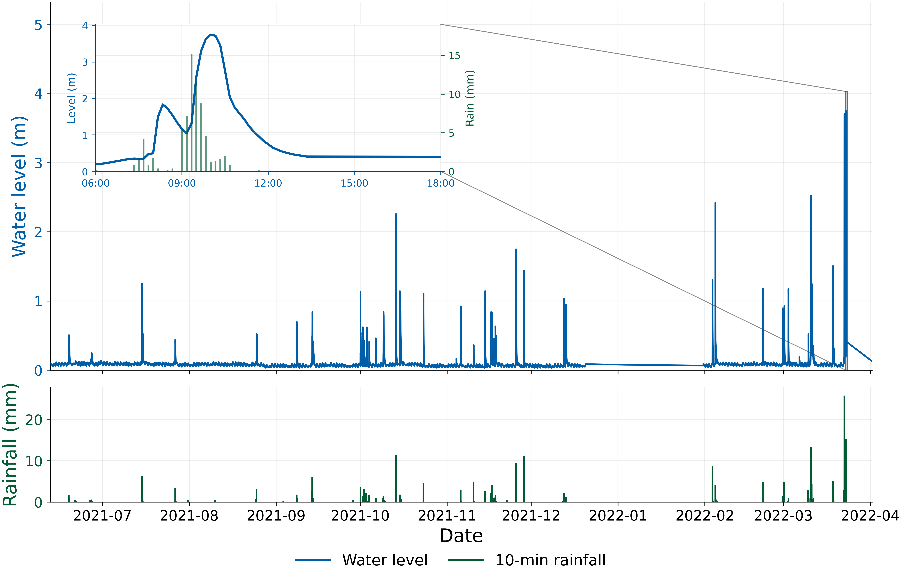
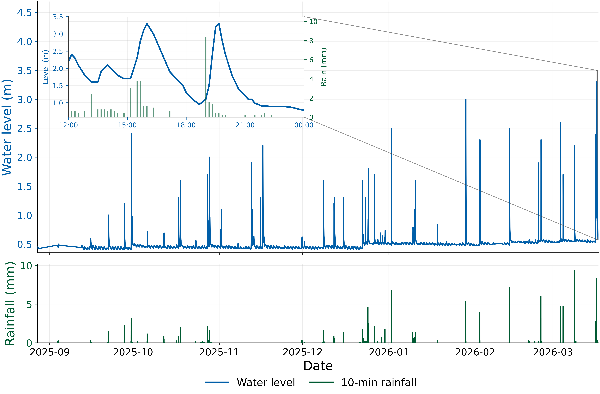
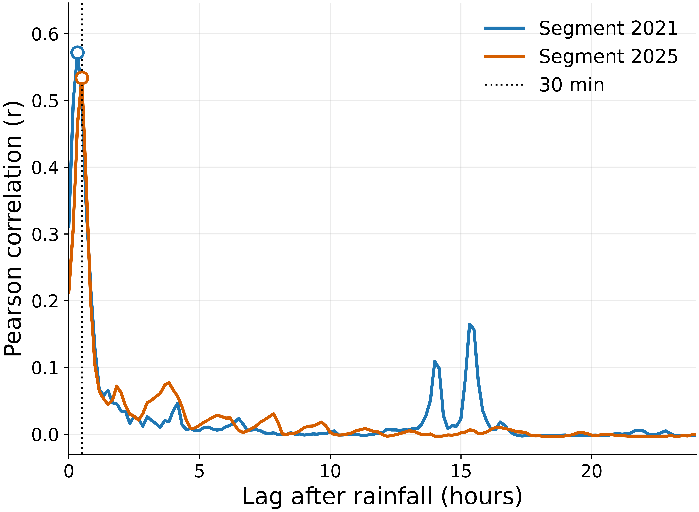
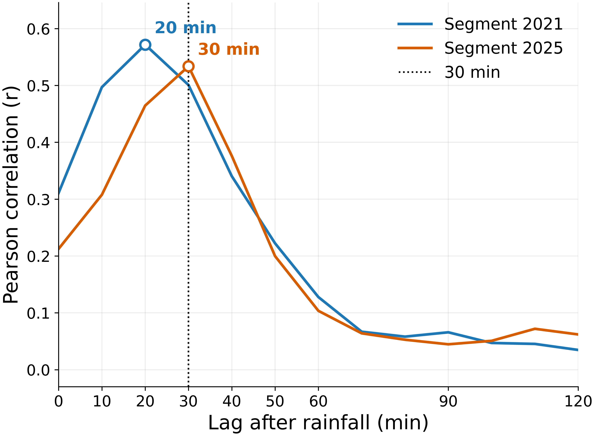
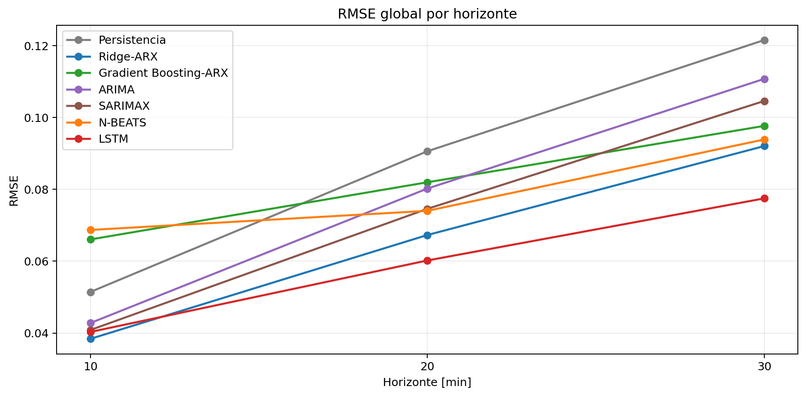
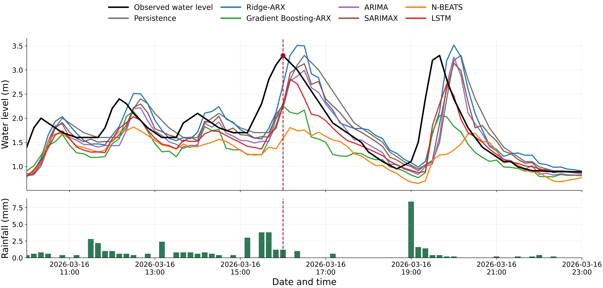
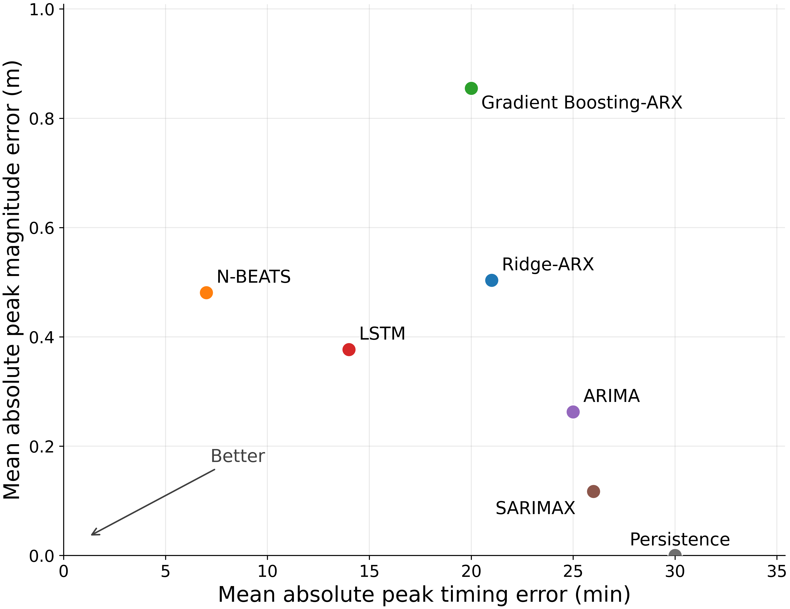
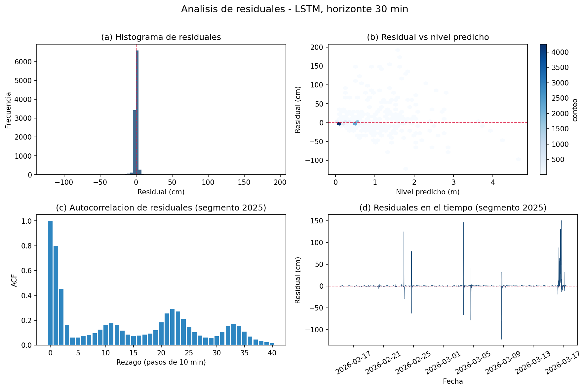

<!-- _class: lead -->
<!-- _paginate: false -->
<!-- _header: '' -->

# Pronóstico de nivel de agua a corto plazo en el arroyo Mburicaó
### Comparación de modelos estadísticos, de ML y de deep learning con evaluación centrada en eventos

**Trabajo Práctico Final — Series Temporales**
Maestría en Inteligencia Artificial

**Autor:** Federico D. Morán Fretes

---

## 1. Problema y motivación

- Los **arroyos urbanos responden a la lluvia en minutos** (superficies impermeables, drenaje, caminos de flujo cortos).
- Para la **alerta temprana**, un modelo útil no solo debe ser preciso *en promedio*: debe ser **oportuno y confiable durante los picos**.
- Un pronóstico que reproduce un pico **30 min tarde** puede tener buen error global pero ser inútil en una crecida.

> **Pregunta del trabajo:** ¿cómo se comportan familias de modelos de complejidad creciente cuando se evalúan **no solo con métricas globales, sino también en los eventos críticos**?

---

## 2. Dataset — Arroyo Mburicaó (Asunción, Paraguay)

- Nivel de agua + precipitación, sensores en el arroyo, **resolución 10 min**.
- **Dos campañas no contiguas**, tratadas como **segmentos independientes** (el hueco 2022–2025 no se rellena).

| Segmento | Período | Muestras | Nivel máx (m) | Lluvia total (mm) |
|---|---|---:|---:|---:|
| 2021–2022 | jun-2021 → abr-2022 | 42 220 | 3.746 | 741.6 |
| 2025–2026 | ago-2025 → mar-2026 | 29 055 | 3.300 | 325.1 |

 

Izq.: período 2021–2022 · Der.: período 2025–2026 (nivel arriba, lluvia abajo, recuadro = evento principal).

---

## 3. Dinámica de lluvia–respuesta → elección de horizontes

- Se mide la correlación entre lluvia y **incrementos positivos futuros del nivel** $\Delta y^+_{t+\tau}$.
- Asociación máxima a **~20 min (2021)** y **~30 min (2025)** → horizontes de **10, 20 y 30 min**.

 

---

## 4. Metodología

- **Pronóstico directo multi-paso:** $\hat{y}_{t+h}$, $h\in\{1,2,3\}$ (10/20/30 min), paso 1.
- **Split cronológico 70/15/15** (train/val/test) **dentro de cada segmento**.
- **Sin fuga de datos:** no se usa lluvia futura observada (solo histórica / del origen).
- **Protocolo común** para todas las familias → predicciones directamente comparables.
- Métricas en 3 niveles: **global (pooled)**, **por horizonte**, y **por ventana de evento**.

---

## 5. Modelos — 7 modelos, 3 categorías

| Categoría | Modelos |
|---|---|
| Base ingenua | Persistencia |
| Machine learning | Ridge-ARX (lineal) · Gradient Boosting-ARX (no lineal) |
| Estadística | ARIMA · SARIMAX (con lluvia exógena) |
| Deep learning | N-BEATS · LSTM (recurrente) |

**Configuraciones:** Ridge-ARX α=1.0 · GB-ARX 200 árboles, prof. 2 · N-BEATS ventana 72 (12 h) · LSTM ventana 288 (48 h), hidden 128 · ARIMA (2,0,1) · SARIMAX (2,0,1)/(1,0,0).

---

<!-- _class: dostablas -->

## 6. Resultados globales y a 30 minutos

**Todos los horizontes**

| Modelo | RMSE | MAPE | NSE |
|---|---:|---:|---:|
| **LSTM** | **6.12** | 3.56 | **0.959** |
| Ridge-ARX | 6.95 | 3.26 | 0.947 |
| SARIMAX | 7.78 | 3.23 | 0.933 |
| N-BEATS | 7.96 | 13.9 | 0.930 |
| ARIMA | 8.27 | 3.31 | 0.925 |
| GB-ARX | 8.29 | 3.54 | 0.924 |
| Persistencia | 9.24 | 2.56 | 0.906 |

**Horizonte 30 min**

| Modelo | RMSE | MAPE | NSE |
|---|---:|---:|---:|
| **LSTM** | **7.75** | 5.08 | **0.934** |
| Ridge-ARX | 9.21 | 4.62 | 0.907 |
| N-BEATS | 9.39 | 4.59 | 0.903 |
| GB-ARX | 9.77 | 4.47 | 0.895 |
| SARIMAX | 10.46 | 4.48 | 0.879 |
| ARIMA | 11.08 | 4.72 | 0.865 |
| Persistencia | 12.16 | 3.49 | 0.837 |

> - **LSTM** es el único que lidera **RMSE y NSE en los dos cortes**, y su ventaja se **amplía** a 30 min (7.75 vs. 9.21 del segundo).
> - Al pasar de global a 30 min **se reacomoda el orden**: los estadísticos (SARIMAX, ARIMA) ceden ante ML/DL → **se degradan más rápido con el horizonte**.
> - El **MAPE contradice** al resto: Persistencia tiene el MAPE más bajo (2.56 %) pero el **peor RMSE y NSE** — está dominado por los períodos de calma y **no ve los picos** (el 13.9 % de N-BEATS es un artefacto de denominadores chicos). **El criterio de decisión acá es RMSE/NSE, no MAPE.**

---

<!-- _class: figcenter -->

## 7. Degradación por horizonte de pronóstico

- El error crece de forma ordenada de 10 → 30 min para todos los modelos.
- El **LSTM mantiene la ventaja en todos los horizontes**.

---

<!-- _class: figcenter -->

## 8. Aporte principal — Curvas de pronóstico en un evento (30 min)

- Las métricas globales **no separan** error de **tiempo** del error de **amplitud**.
- Varios modelos reproducen la forma del hidrograma pero **difieren en tiempo y magnitud** del pico.

---

## 9. Métricas centradas en eventos (peak timing & magnitude)

10 eventos críticos · horizonte 30 min · errores en cm / min:

| Modelo | PTE abs (min) | Error pico abs (cm) | RMSE evento (cm) | NSE evento |
|---|---:|---:|---:|---:|
| **LSTM** | 14 | 37.7 | **38.1** | **0.584** |
| N-BEATS | **7** | 48.1 | 42.8 | 0.404 |
| Ridge-ARX | 21 | 50.3 | 45.8 | 0.439 |
| GB-ARX | 20 | 85.5 | 49.5 | 0.375 |
| SARIMAX | 26 | **11.7** | 55.4 | 0.219 |
| ARIMA | 25 | 26.3 | 59.1 | 0.098 |
| Persistencia | 30 | **0.0** | 64.9 | −0.056 |

Persistencia conserva magnitud pero **se retrasa**; SARIMAX acierta magnitud pero **llega tarde**; N-BEATS acierta **tiempo** pero subestima amplitud.

---

<!-- _class: figcenter -->

## 10. Compromiso timing vs. magnitud

- El plano de error hace **explícito el compromiso operativo**.
- El **LSTM no gana ninguna dimensión aislada, pero ocupa la región balanceada** y logra el menor RMSE de evento.

---

<!-- _class: figcenter -->

## 11. Análisis de residuales (LSTM, 30 min)

- Residuales **concentrados en cero**, pero **heterocedásticos**: crecen en niveles altos (picos).
- El error se concentra en **eventos puntuales**, no en la calma → confirma la tesis del trabajo.

---

## 12. Conclusiones

- **7 modelos** comparados bajo un protocolo común, en 2 segmentos independientes, a 10/20/30 min.
- **LSTM = mejor desempeño global** (RMSE 6.12 cm, NSE 0.959) **y** mejor RMSE de evento.
- Modelos con precisión global similar **fallan de maneras distintas en los picos** (tiempo vs. amplitud).
- **Implicación:** en hidrología urbana de respuesta rápida, evaluar con **métricas puntuales + diagnósticos centrados en eventos** que separen error de tiempo y de magnitud de pico.

 

> **Limitaciones:** un único arroyo, pocos eventos de pico, sin pronóstico de lluvia futura ni variables hidráulicas (caudal).

---

<!-- _class: lead -->
<!-- _paginate: false -->
<!-- _header: '' -->

# ¡Gracias!

**Federico D. Morán Fretes**
TPF — Series Temporales · Maestría en IA

Repositorio: `https://github.com/fedemoranf-alt/tpf-series-temporales-mburicao`
